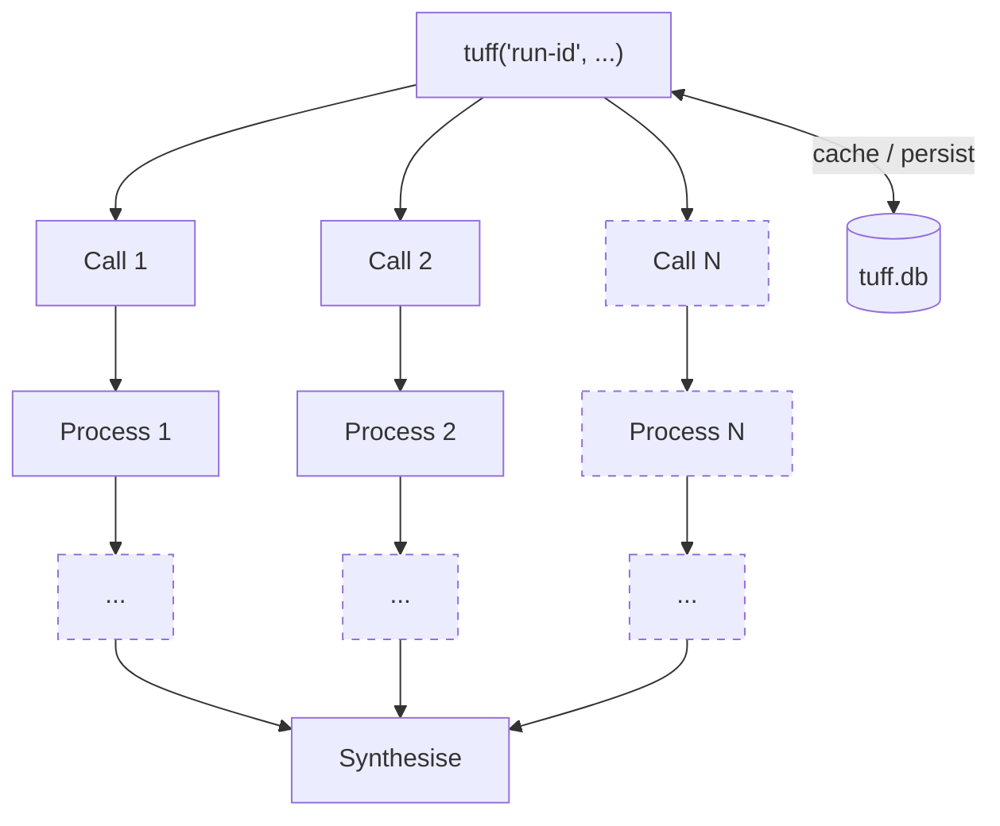

# Tuff Lil Unit


A lil resumable pipeline toolkit for iterative AI workflow development.

Background a multi-step workflow while it runs. Drop and rerun any step as you iterate. Ask your AI about progress and results mid-run from your main thread, and it'll query via SQL.

Tuff's an ultra-simple version of the 'step function' pattern from hardcore workflow tools like Temporal.

It's for building reusable multi-step workflows using AI coding tools like Claude Code, Cowork, Codex and friends.

It ain't big. It ain't clever. It's just a little TypeScript and a SQLite database.

## In practice

A GEO study with synthetic personas — hundreds of GPT queries mimicking customer searches, responses post-processed, citations fetched and analysed — iteratively refined and re-run on the fly.



## Features

- **Any step, any function** — steps can be LLM API calls, HTTP fetches, pure computation, or anything async. Not just agent calls.
- **Every step is drop + rerunnable** — change the logic, clear the step, rerun from that point. Earlier steps stay cached.
- **Queryable mid-run** — step results, token usage, and durations land in a local SQLite db as they complete. Ask Claude to query it from your main thread while the pipeline runs in the background.
- **Domain storage** — define your own data tables in the same SQLite db alongside Tuff's state tables.
- **Slot-based concurrency** — new tasks start when a slot opens. Set limits per stage: fan out high for fetches, throttle back for LLM calls.
- **Token budget** — global and per-step limits.
- **Three providers** — Anthropic API, OpenAI API, or Claude Code CLI using your subscription.

## Get started

Install the skill:

```
/plugin marketplace add unfamiliar-city/marketplace
/reload-plugins
/plugin install tuff
```

Then use it:

```
Claude Code
Opus 4.6 · Claude API
~/Projects/myproject

 > /tuff build me a pipeline to make a million bucks.
```

## Code example

```ts
// Pipeline 'my-pipeline', state persisted to ./state/tuff.db
await tuff('my-pipeline', { stateDir: './state' }, async (ctx) => {

  // Resumable step — if this succeeded before, returns cached result instantly
  const data = await ctx.step('fetch', async () => fetchAll());

  // Fan out — one step per item, concurrent within slot limit
  // Each has a unique ID, so on resume only uncompleted ones re-execute
  const results = await Promise.all(
    data.map((item) => ctx.step(item.id, async () => process(item)))
  );

  // Fan in — summarise all results
  return ctx.step('summarise', async () => summarise(results));
});
```

## Status

Alpha.

**Claude Code CLI provider** — a house of cards on top of undocumented Claude Code internals. As of June 2026, `claude -p` draws from a separate Agent SDK credit pool (limited monthly allowance, overages billed at full API rates). Use with care.

## License

MIT